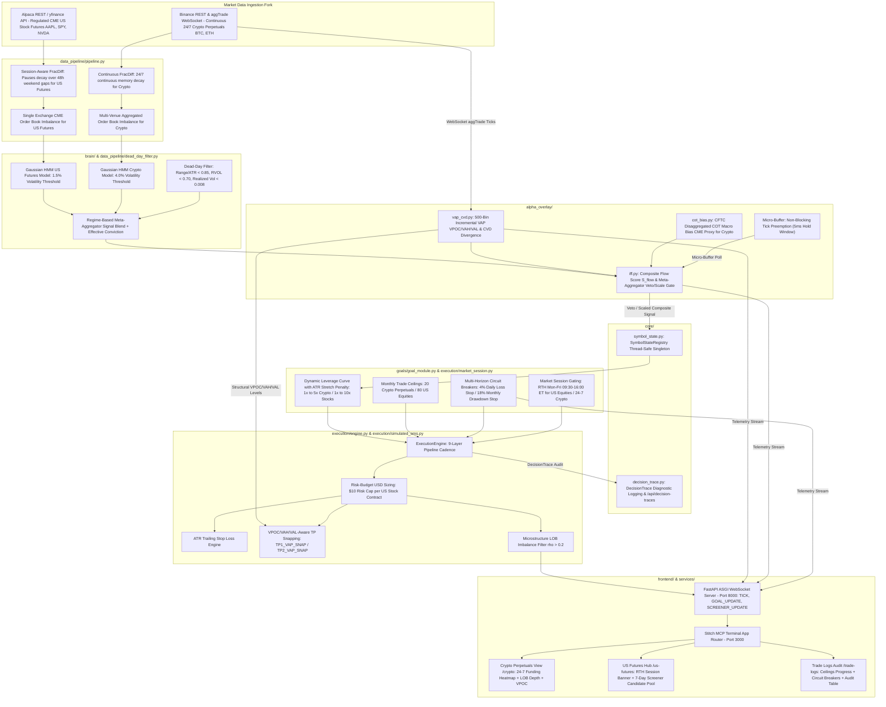

# TRDENG — System Architecture Diagram

```mermaid
graph TD
    subgraph Market Data Ingestion Fork
        A1["Alpaca REST / yfinance API - Regulated CME US Stock Futures AAPL, SPY, NVDA"]
        A2["Binance REST & aggTrade WebSocket - Continuous 24/7 Crypto Perpetuals BTC, ETH"]
    end

    subgraph 1. Feature Engineering & Stationarity Fork [data_pipeline/pipeline.py]
        B1["Session-Aware FracDiff: Pauses decay over 48h weekend gaps for US Futures"]
        B2["Continuous FracDiff: 24/7 continuous memory decay for Crypto"]
        B3["Single Exchange CME Order Book Imbalance for US Futures"]
        B4["Multi-Venue Aggregated Order Book Imbalance for Crypto"]
    end

    subgraph 2. ML Ensemble & Dead-Day Filter [brain/ & data_pipeline/dead_day_filter.py]
        C1["Gaussian HMM US Futures Model: 1.5% Volatility Threshold"]
        C2["Gaussian HMM Crypto Model: 4.0% Volatility Threshold"]
        C3["Dead-Day Filter: Range/ATR < 0.85, RVOL < 0.70, Realized Vol < 0.008"]
        C4["Regime-Based Meta-Aggregator Signal Blend + Effective Conviction"]
    end

    subgraph 3. IFF Alpha Overlay & Predictive Microstructure [alpha_overlay/]
        G1["vap_cvd.py: 500-Bin Incremental VAP VPOC/VAH/VAL & CVD Divergence"]
        G2["cot_bias.py: CFTC Disaggregated COT Macro Bias CME Proxy for Crypto"]
        G3["iff.py: Composite Flow Score S_flow & Meta-Aggregator Veto/Scale Gate"]
        G4["Micro-Buffer: Non-Blocking Tick Preemption (5ms Hold Window)"]
    end

    subgraph 4. State & Audit Logging [core/]
        H1["symbol_state.py: SymbolStateRegistry Thread-Safe Singleton"]
        H2["decision_trace.py: DecisionTrace Diagnostic Logging & /api/decision-traces"]
    end

    subgraph 5. Goal & Risk Gating Module [goals/goal_module.py & execution/market_session.py]
        D1["Dynamic Leverage Curve with ATR Stretch Penalty: 1x to 5x Crypto / 1x to 10x Stocks"]
        D2["Monthly Trade Ceilings: 20 Crypto Perpetuals / 80 US Equities"]
        D3["Multi-Horizon Circuit Breakers: 4% Daily Loss Stop / 18% Monthly Drawdown Stop"]
        D4["Market Session Gating: RTH Mon-Fri 09:30-16:00 ET for US Equities / 24-7 Crypto"]
    end

    subgraph 6. Order Execution Engine [execution/engine.py & execution/simulated_oms.py]
        E0["ExecutionEngine: 9-Layer Pipeline Cadence"]
        E1["Risk-Budget USD Sizing: $10 Risk Cap per US Stock Contract"]
        E2["ATR Trailing Stop Loss Engine"]
        E3["VPOC/VAH/VAL-Aware TP Snapping: TP1_VAP_SNAP / TP2_VAP_SNAP"]
        E4["Microstructure LOB Imbalance Filter rho > 0.2"]
    end

    subgraph 7. Stitch MCP Institutional Presentation Layer [frontend/ & services/]
        F1["FastAPI ASGI WebSocket Server - Port 8000: TICK, GOAL_UPDATE, SCREENER_UPDATE"]
        F2["Stitch MCP Terminal App Router - Port 3000"]
        F3["Crypto Perpetuals View /crypto: 24-7 Funding Heatmap + LOB Depth + VPOC"]
        F4["US Futures Hub /us-futures: RTH Session Banner + 7-Day Screener Candidate Pool"]
        F5["Trade Logs Audit /trade-logs: Ceilings Progress + Circuit Breakers + Audit Table"]
    end

    A1 --> B1 --> B3
    A2 --> B2 --> B4
    A2 -- WebSocket aggTrade Ticks --> G1
    B3 --> C1
    B4 --> C2
    C1 & C2 & C3 --> C4
    C4 & G1 & G2 --> G3
    G3 -- Veto / Scaled Composite Signal --> H1
    G4 -- Micro-Buffer Poll --> G3
    H1 --> D1
    G1 -- Structural VPOC/VAH/VAL Levels --> E3
    D1 & D2 & D3 & D4 --> E0
    E0 --> E1
    E1 --> E2 & E3 & E4
    E0 -- DecisionTrace Audit --> H2
    E4 --> F1 --> F2
    F2 --> F3 & F4 & F5
    G1 & G3 & D3 -- Telemetry Stream --> F1
```
