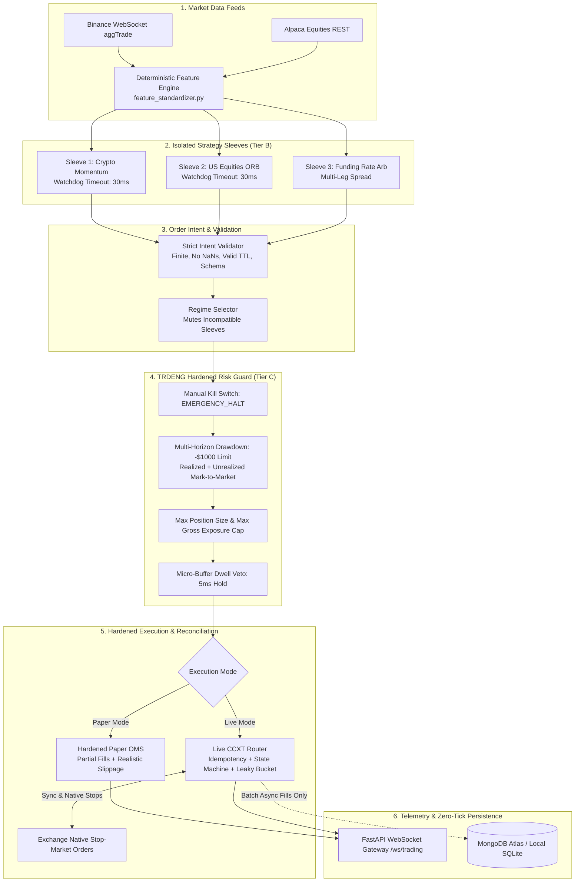

# TRDENG Hardened Production Implementation Plan
## End-to-End Capital Safety, Exchange Reconciliation & Modular Strategy Execution

---

## 1. Architectural Post-Mortem & Core Reforms

This revised plan addresses the critical gaps identified in the prototype:

### Gap 1: The Live Execution & Exchange Reconciliation Problem
* **Old Flaw**: `live_ccxt_router.py` was a placeholder without idempotency, position reconciliation, rate-limiting, or partial-fill handling.
* **The Reform**: Phase 1 now builds a **Hardened Execution Router** with:
  1. **Client Order IDs (`clOrdId`) & Idempotency**: Every order proposal generates a deterministic, deduplicated `clOrdId`. Retries never double-fill.
  2. **Exchange State Machine**: Explicit states: `PENDING_SUBMIT`, `SUBMITTED`, `PARTIALLY_FILLED`, `FILLED`, `CANCELED`, `REJECTED`, `EXPIRED`.
  3. **Periodic & Reconnect Reconciliation**: On engine boot or network reconnect, the router queries the exchange (`fetch_positions()`, `fetch_open_orders()`), compares against local memory, and forces state reconciliation.
  4. **Rate-Limiting (Token Bucket)**: Leaky-bucket pacing preventing exchange HTTP 429 penalties.

### Gap 2: The Heartbeat Fail-Safe Trap
* **Old Flaw**: Falling back to the paper OMS when the exchange connection drops leaves real open positions unmanaged while the system thinks it's simulating.
* **The Reform**:
  * **Zero Silent Fallback**: The engine **NEVER** silently falls back to paper simulation when live.
  * **Emergency Disconnect Protocol**:
    1. **Exchange-Side Native Stops**: All entries immediately place server-side stop-market orders directly on the exchange at fill time. If the bot crashes, the exchange still protects capital.
    2. **Halt Entries & Alert**: Transition state to `EMERGENCY_HALT`. No new trades are permitted.
    3. **Reconnection & Audit**: Exponential backoff reconnect $\rightarrow$ audit positions $\rightarrow$ log state $\rightarrow$ resume only if verified.

### Gap 3: Signal Blending & The Cancellation Dilemma
* **Old Flaw**: Weighted average of direction values ($w_1 \cdot \text{ORB} + w_2 \cdot \text{VPOC}$) causes trend and mean-reversion signals to cancel out to 0 (flat), inducing indecision paralysis.
* **The Reform**:
  * **Independent Capital Sleeves (Sub-Portfolios)**: Each strategy operates in its own dedicated capital sleeve (e.g., 40% capital to Sleeve A, 30% to Sleeve B) with isolated PnL, independent position tracking, and distinct risk caps.
  * **Regime-Conditional Selection**: The Meta-Aggregator acts as a **Selector**, not an Averager. In high-trend regimes, it activates the Trend Sleeve and mutes the Reversion Sleeve.

### Gap 4: Rich Order Intent & Multi-Leg Support
* **Old Flaw**: A thin `df -> direction` float cannot express multi-leg trades (e.g. Funding Rate Arb: Long Spot + Short Perp), position-aware exits, or signal expiration.
* **The Reform**: Upgrade to `OrderIntent` supporting:
  * `legs: List[OrderLeg]` (supports single-asset directional or multi-leg delta-neutral spreads).
  * `intent_type`: `ENTRY`, `EXIT`, `SCALE_IN`, `SCALE_OUT`, `CANCEL`.
  * `time_to_live_sec` (TTL expiration).
  * `PositionContext` passed into `generate_signal(symbol, df, position_context)`.

### Gap 5: Optuna Overfitting & Database Hot-Reload Security
* **Old Flaw**: Auto-writing 10,000 parameter sweeps to MongoDB and hot-reloading into live trading creates an automated curve-fitting pipeline with zero security.
* **The Reform**:
  * **Parameter Promotion Pipeline**: `RESEARCH` $\rightarrow$ `WALK_FORWARD_VALIDATION` $\rightarrow$ `PAPER_SOAK (7 Days)` $\rightarrow$ `MANUAL_PROMOTION_LIVE`.
  * **Parameter Versioning & Hashing**: Every config update logs `git_commit`, `dataset_range`, and `promoted_by`.
  * **API Authentication**: `POST /api/strategies/{id}/toggle` requires `X-API-KEY` or Bearer Token authentication.

### Gap 6: Train/Serve Skew & Latency Honesty
* **Old Flaw**: Automatic fallback between `pandas-ta` and `TA-Lib` produces numerical indicator drift. "Microsecond" claim was unrealistic for Python.
* **The Reform**:
  * **Pinned Indicator Core**: Standardize on a single, deterministic feature engine (`feature_standardizer.py`) for both training and live feeds.
  * **Honest Latency Range**: Explicitly design and benchmark for **$5\text{ms} - 25\text{ms}$** Python/Pandas execution cadences.

---

## 2. Hardened System Topology



---

## 3. Revised Phased Implementation Roadmap (Vertical Slice First)

Instead of building broad horizontal shells that cannot safely execute real money, the implementation follows a **Vertical Slice Strategy**: build one simple strategy end-to-end, harden the order router and risk guard, soak in paper trading, and only then add research tools and advanced strategies.

```
Phase 1: Rich OrderIntent Contract & Input/Output Validation
   │
   ▼
Phase 2: Hardened Risk Guard & Absolute Capital Safety
   │
   ▼
Phase 3: Hardened Execution Router (CCXT + Native Stops + Reconcile)
   │
   ▼
Phase 4: Single End-to-End Vertical Slice & Paper Soak
   │
   ▼
Phase 5: Capital Sleeves & Multi-Strategy Hub (ORB + Funding Arb)
   │
   ▼
Phase 6: Protected Strategy Parameter Promotion & Auth
   │
   ▼
Phase 7: Offline Research Suite (Optuna + VectorBT + QuantStats)
```

---

## 4. Phase-by-Phase Engineering Specifications

### Phase 1: Rich OrderIntent Contract & Validation
* **Goal**: Replace the thin direction float with a robust, multi-leg capable `OrderIntent` schema with strict validation and watchdog timeouts.
* **Files**:
  - `core/order_intent.py`:
    - `OrderIntent` dataclass with `strategy_id`, `sleeve_id`, `intent_type` (`ENTRY`, `EXIT`, `SCALE`), `legs: List[OrderLeg]`, `stop_loss_price`, `take_profit_price`, `time_to_live_sec`, `created_at`.
    - `PositionContext`: current position size, entry price, open duration, unrealized PnL passed to strategy.
  - `strategies/strategy_validator.py`:
    - Validates no `NaN`/`Inf`, prices $> 0$, sizes $> 0$, direction $\in [-1, 1]$.
    - Watchdog execution wrapper: enforces a **30ms timeout** per strategy; halts strategy if it hangs.
* **Verification Test**: `pytest tests/test_order_intent.py`

---

### Phase 2: Hardened Risk Guard & Absolute Capital Safety
* **Goal**: Expand the Risk Guard with explicit definitions of loss limits, exposure caps, and emergency kill switches.
* **Files**:
  - `goals/hardened_risk_guard.py`:
    - `MAX_MONTHLY_LOSS_USD`: evaluated on **Equity (Realized + Unrealized MTM)**, not just closed trades.
    - `MAX_POSITION_SIZE_USD` and `MAX_GROSS_PORTFOLIO_EXPOSURE_USD`.
    - `EMERGENCY_KILL_SWITCH`: instant memory toggle that immediately halts new orders, flattens open positions, or sets post-only reduction.
* **Verification Test**: `pytest tests/test_hardened_risk_guard.py`

---

### Phase 3: Hardened Live Execution Router & Reconciliation
* **Goal**: Build production-grade CCXT execution with client order IDs, state machines, exchange-side native stops, and restart reconciliation.
* **Files**:
  - `execution/hardened_ccxt_router.py`:
    - `ClientOrderId` generation: `trd_{strategy}_{symbol}_{timestamp_ms}`.
    - Exchange reconciliation: `reconcile_positions()` queries exchange on boot and syncs with local registry.
    - Server-side native stops: places exchange-level `STOP_MARKET` order immediately upon entry fill.
    - Leaky bucket rate limiter: enforces max 10 requests/sec with exponential backoff on HTTP 429.
    - Disconnect protocol: if WebSocket drops, transition to `HALT_ENTRIES`, rely on resting exchange stops, and attempt exponential reconnect.
* **Verification Test**: `pytest tests/test_hardened_ccxt_router.py`

---

### Phase 4: Single End-to-End Strategy & Paper Trading Soak
* **Goal**: Wire one clean baseline strategy through the entire pipeline into paper trading for stability soak testing.
* **Files**:
  - `strategies/crypto/bollinger_reversion.py`: Clean, standalone, fast mean-reversion strategy.
  - `tests/integration/test_vertical_slice.py`: Tests the full pipeline:
    `Tick Ingestion -> Feature Engine -> Strategy -> Intent Validator -> Risk Guard -> Execution Router -> Fill Event`.
* **Verification Metric**: Complete end-to-end simulation passes 10,000 synthetic ticks with zero dropped fills and 100% reconciliation accuracy.

---

### Phase 5: Capital Sleeves & Multi-Strategy Hub
* **Goal**: Decouple strategies into independent capital sleeves to eliminate signal cancellation, and add multi-leg spread execution.
* **Files**:
  - `strategies/sleeve_manager.py`:
    - Sub-allocates capital: e.g. Sleeve A ($4,000), Sleeve B ($3,000).
    - Prevents signal cancellation: Sleeve A can hold Long while Sleeve B holds Short without mutual destruction.
  - `strategies/stocks/orb_session.py`: Opening Range Breakout strategy.
  - `strategies/crypto/funding_rate_spread.py`: Multi-leg cash & carry spread strategy.
* **Verification Test**: `pytest tests/test_sleeve_manager.py`

---

### Phase 6: Parameter Versioning, Promotion Pipeline & Security
* **Goal**: Prevent Optuna curve-fitting directly into production and secure strategy management endpoints.
* **Files**:
  - `middleware/strategy_promotion.py`:
    - Enforces promotion lifecycle: `RESEARCH` -> `WALK_FORWARD` -> `PAPER_CANDIDATE` -> `APPROVED_LIVE`.
    - Logs parameter hashes and backtest metric benchmarks.
  - `services/auth_middleware.py`:
    - Adds API key authentication to `POST /api/strategies/{id}/toggle` and `/api/risk/kill-switch`.
* **Verification Test**: `pytest tests/test_strategy_promotion.py`

---

### Phase 7: Offline Research & Tuning Suite (Isolated)
* **Goal**: Provide Optuna Bayesian optimization, VectorBT screening, and Backtrader/QuantStats validation in offline standalone scripts.
* **Files**:
  - `research/optuna_tuner.py`: Walk-forward Bayesian optimization with out-of-sample testing.
  - `research/vbt_screener.py`: Vectorized parameter sweep.
  - `research/bt_validator.py`: Event-driven backtest reporting HTML tearsheets.
* **Verification Test**: `pytest tests/test_research_suite.py`

---

## 5. Summary: Key Architecture Upgrades

| Vulnerability in Prototype | Hardened Production Architecture |
| :--- | :--- |
| **Silent Paper Fallback on Disconnect** | **Emergency Disconnect Protocol**: Native resting stops on exchange; halts entries; reconciles on reconnect. |
| **Undefined Order Execution** | **Hardened CCXT Router**: Deterministic Client Order IDs (`clOrdId`), order state machine, rate-limiting, and startup position reconciliation. |
| **Directional Blending Cancellation** | **Independent Capital Sleeves**: Each strategy manages its own sub-portfolio capital; Meta-Aggregator acts as a regime selector. |
| **Thin Signal Float** | **Rich OrderIntent**: Supports multi-leg spreads (Funding Arb), position-aware exits, order TTL, and strict schema validation. |
| **Optuna Overfitting to Live DB** | **Promotion Pipeline**: Research $\rightarrow$ Out-of-Sample Walk Forward $\rightarrow$ 7-day Paper Soak $\rightarrow$ Auth-Gated Live Promotion. |
| **In-Process Strategy Hangs / NaNs** | **Strategy Watchdog**: 30ms hard timeout per strategy, type & boundary validation, zero unhandled NaN propagation. |
| **Train/Serve Feature Drift** | **Single Deterministic Indicator Engine**: Pinned calculation across historical backtests and live streams. |
